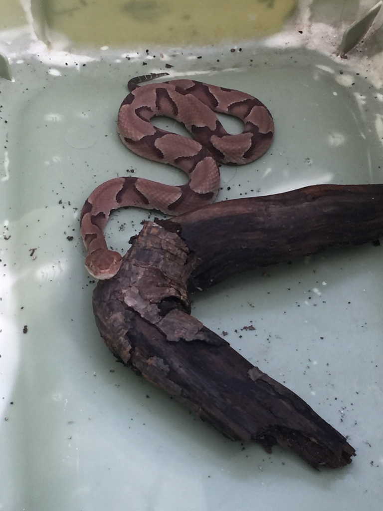
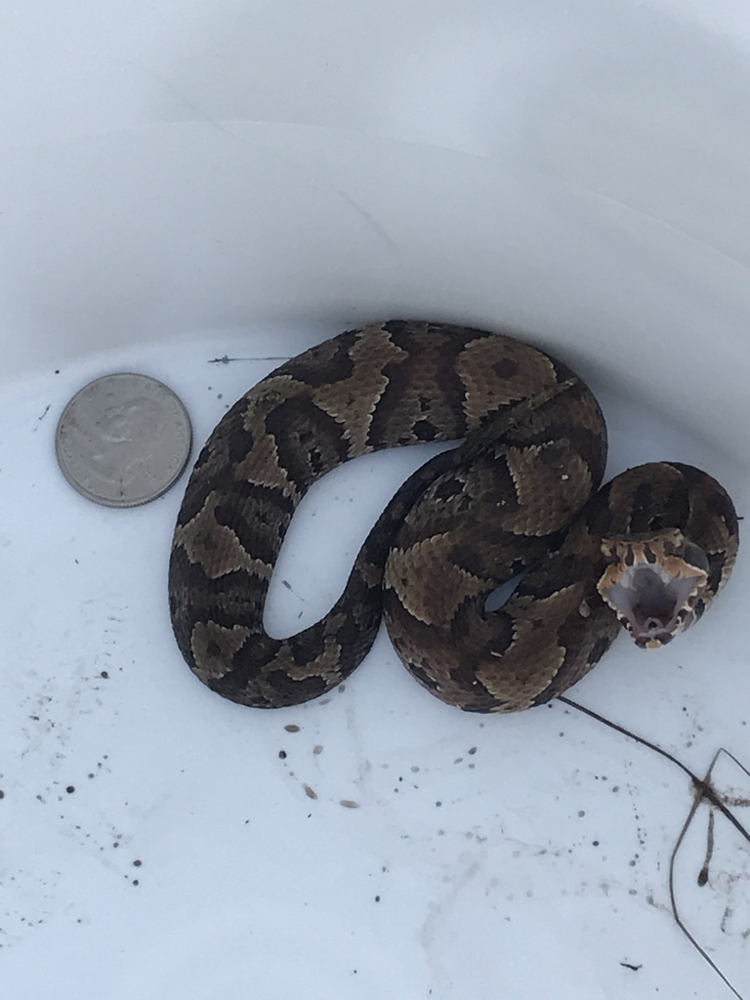

# SnakeID Image Classifier

  
  

This model uses transfer learning and Google's Inception V3 CNN to classify images of different species of snake. The model classifies images into 2 species classes currently with about 88% accuracy. Future project goals include adding many more species to the image library and continued development of a web app in Flask.

# Table of Contents
* [Tools](#tools)
* [Usage](#usage)
* [Output](#output)

# Tools
* Docker
* Tensorflow Docker Image
* Flask

# Usage
* Compile your own image library by web scraping (as in get_images) and through iNaturalist's CSV downloader.
* Rename and restructure image library if necessary
* Download Docker and download Macguyver Tensorflow image
* Run macguyver_model.sh

# Output
<table border="0">
 <tr>
    <td><b style="font-size:30px">Test Image #1</b>
      
   </td>
    <td><b style="font-size:30px">Test Image #2</b>
      
   </td>
 </tr>
</table>
<!--

  
  

-->
<!--
<table>
  <tr>
   <th>Test Image #1</th>
   <th>Test Image #2</th>
  </tr>
  <tr>
   <td>text in column</td>
   <td>text in column</td>
   <td>text in column</td>
   
   
  </tr>
 </table>
 -->
<table width="500" border="0" cellpadding="5">

<tr>

<td align="center" valign="center">

 
Test Image #1
</td>

<td align="center" valign="center">
  Caption text centered under the image.
   

</td>

</tr>

</table>
