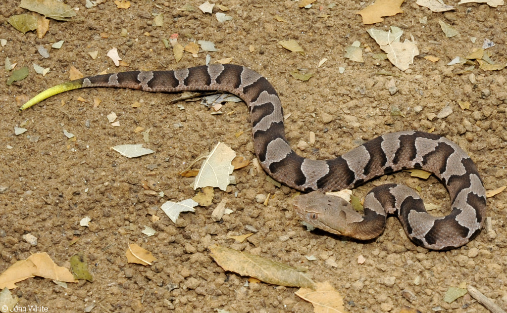
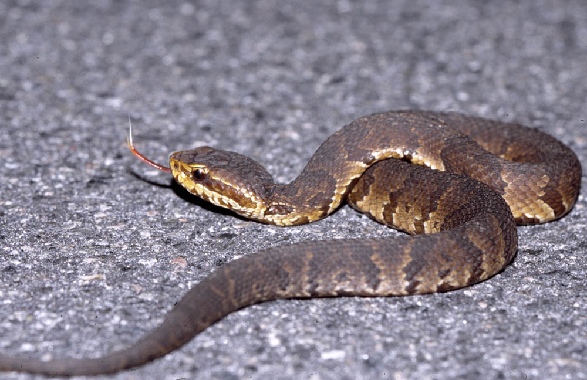

# SnakeID Image Classifier

  
  

This model uses transfer learning and Google's Inception V3 CNN to classify images of different species of snake. The model classifies images into 2 species classes currently with about 88% accuracy. Future project goals include adding many more species to the image library and continued development of a web app in Flask.

# Table of Contents
* [Requirements](#requirements)
* [Usage](#usage)

# Tools
* Docker
* Tensorflow Docker Image
* Flask

# Usage
* Compile your own image library by web scraping (as in get_images) and through iNaturalist's CSV downloader.
* Rename and restructure image library if necessary
* Download Docker and download Macguyver Tensorflow image
* Run macguyver_model.sh

