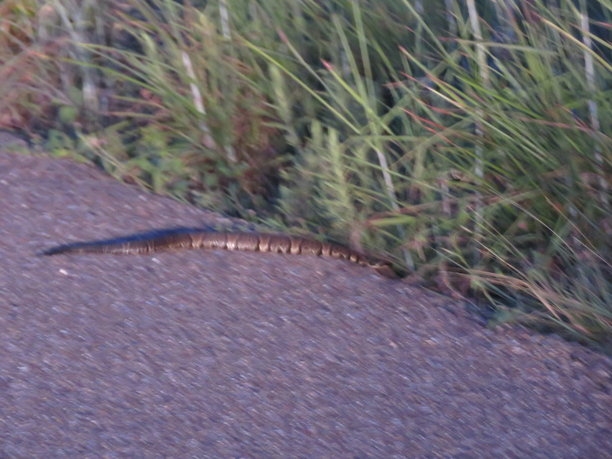

# SnakeID Image Classifier

  
  

This model uses transfer learning and Google's Inception V3 convolutional neural network to classify images of different species of the suborder *Serpentes*, specifically those of the genus *Agkistrodon*. The model currently classifies 2 species classes with about 89% overall accuracy. Future project goals include adding many more species to the image library and continued development of a web application in Flask.

# Table of Contents
* [Tools](#tools)
* [Methodology](#method)
* [Example Output](#eoutput)

# Tools
* Python
* Docker
* Tensorflow Docker Image (from Macgyver)
* Flask
* HTML

# Methodology
* Compiled image library by web scraping (get_images.py) and through iNaturalist's CSV downloader
* Renamed and restructured image library for 2 image classes
* Downloaded Docker and Macgyver Tensorflow Docker image
* Ran various commands from macgyver_model.sh to import, train, and test model on image library
<table align="center">
<tr>
<td align="center">Overall Model Accuracy</td>
<td align="center"> </td>
</tr>
</table>
* Currently working to interface model with front-end web application built with Flask

# Example Output
| Test Image #1  | Test Image #2 |
| ------------- | ------------- |
|   |   |
|   |   |
